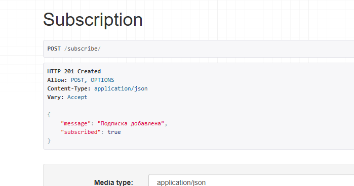
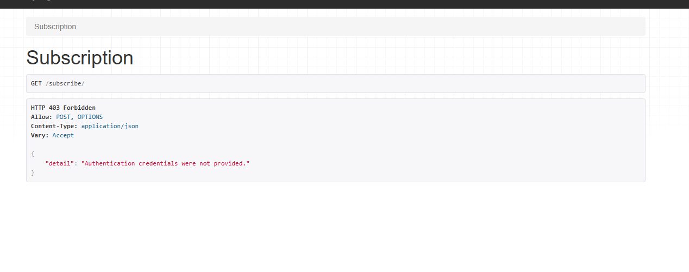

## 📌 Домашнее задание: Celery + Redis + Django

### 🔧 Настроено:
- Celery + Redis как брокер и хранилище результатов
- celery-beat для периодических задач
- Отправка писем подписчикам курса (асинхронно)
- Автоблокировка неактивных пользователей по `last_login`

### 🕒 Периодическая задача:
- `users.tasks.block_inactive_users` — каждый день

### 📨 Email при обновлении курса:
- `courses.tasks.send_course_update_email` — при обновлении курса

### 🧪 Проверка:
- Все задачи проверены вручную
- Celery и Redis работают корректно

---

### ▶️ Запуск

**Окно 1 — Redis**  
Убедитесь, что Redis запущен (Memurai или Redis CLI)

**Окно 2 — Celery Worker**

```bash
celery -A edu_platform worker --loglevel=info

## Подписка — проверка авторизации

POST `/subscribe/` с телом `{"course_id": <ID>}`

- Авторизован: `201` при первом POST (подписка), `200` при повторном (отписка).
- Неавторизован: `401/403`.





### Быстрый старт
```bash
pip install -r requirements.txt
python manage.py migrate
python manage.py runserver
